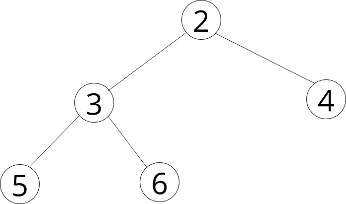

# Árvores de dados [Link para o Vídeo](https://www.youtube.com/watch?v=1-l_UOFi1Xw)

> É utilizada nomenclatura em português para claridade

## O que é?


Estrutura de dados em que uma seção pode ter diversas seções filhas, que em si podem ter seções filhas. Nenhuma seção pode ser filha de duas seções diferentes.

> Há também a árvore de valor universal (onde todos os valores da árvore ou subárvore são iguais)

``SecaoArvore.ts``
```typescript
class SecaoArvore {
    valor : number
    esquerda : SecaoArvore
    direita : SecaoArvore

    constructor(val : number) {
        this.valor = val
        this.direita = null
        this.esquerda = null
    }

    atribuirEsquerda(esquerda: SecaoArvore){
        this.esquerda = esquerda
    }
    atribuirDireita(direita : SecaoArvore){
        this.direita = direita
    }
}
```
A classe acima define uma árvore binária em que os valores são números, e onde é possível atribuir objetos da mesma classe para as propriedades `esquerda` e `direita`.

Dada a árvore abaixo, a tarefa era criar uma função que calculasse a soma dos valores da árvore como um todo. Adicionalmente, calculei o número de seções.



```typescript
let numeroDeSecoes = 0

function encontrarSoma (secaoRaiz: SecaoArvore){
    numeroDeSecoes ++
    if(secaoRaiz === null) return 0
    else return secaoRaiz.valor + encontrarSoma(secaoRaiz.esquerda) + encontrarSoma(secaoRaiz.direita)
}
console.log(encontrarSoma(raiz)) // 20
console.log(numeroDeSecoes)// 5
```

